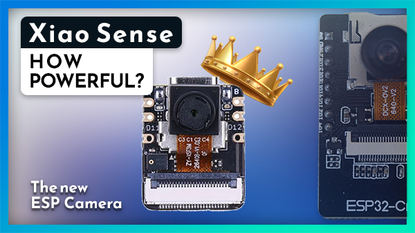
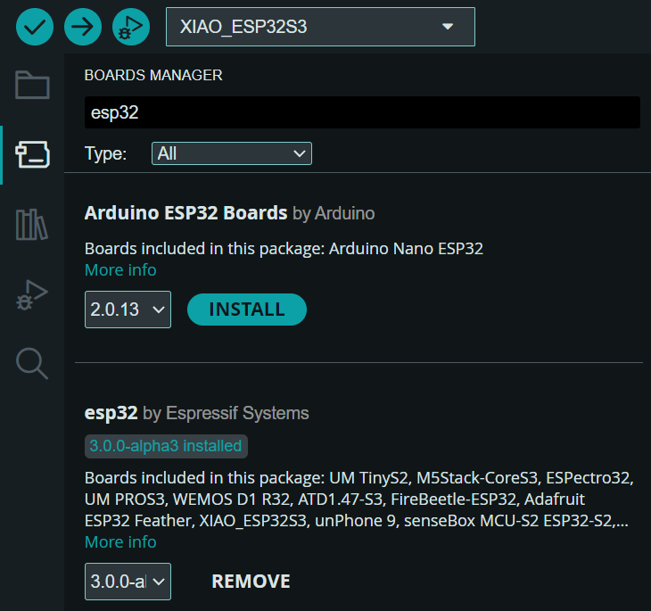
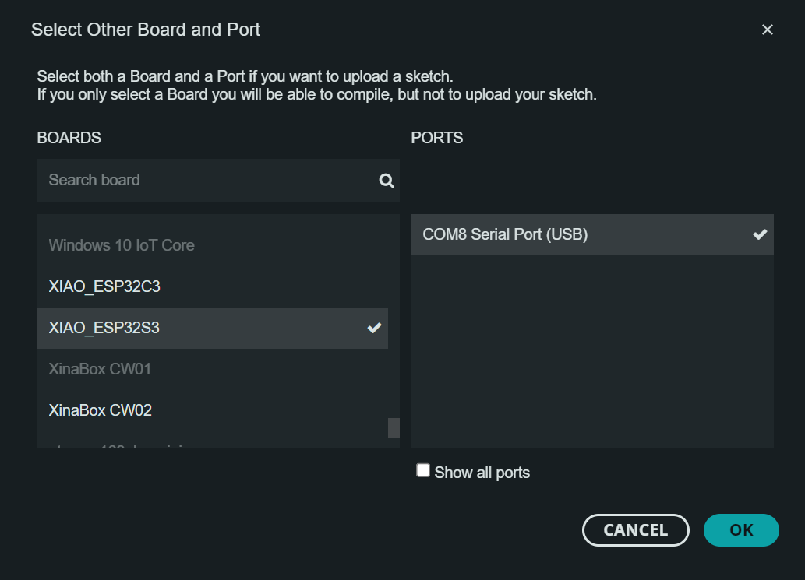
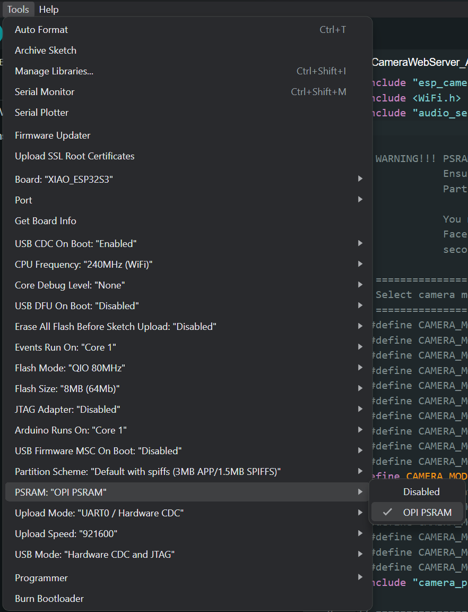

# Xiao_Sense_CameraWebServer_Audio 📸🎙️

This sketch allows you to use the Xiao ESP32S3 Sense as a webserver for streaming microphone and camera feeds, based on the Arduino CameraWebServer example.

**Supported cameras:**

- OV2640 (stock)
- OV5640

You can find more about the Xiao ESP32S3 Sense in my YouTube video here ⤵️

[](https://www.youtube.com/watch?v=_67m6rpgLw4)

## How to Use it

### Sketch configuration

Configure your WiFi network credentials in the [`Xiao_Sense_CameraWebServer_Audio.ino`](https://github.com/fabio-garavini/Xiao_Sense_CameraWebServer_Audio/Xiao_Sense_CameraWebServer_Audio.ino) file.

```sketch
const char* ssid = "ssid";
const char* password = "password";
```

### Compile and Upload

Make sure to have installed `esp32` in your Arduino IDE Boards Manager, otherwise you can't compile any code for any esp32 board.
If you don't you can follow [this guide](https://docs.espressif.com/projects/arduino-esp32/en/latest/installing.html#installing-using-arduino-ide).



1. 🔌 Connect the Xiao Sense to your computer
2. ⚡ Select you COM port and Board
    
3. ⚙️ In the `Tools>PSRAM` menu select `OPI PSRAM`
    
4. ⬆️ Upload

### WebServer paths

- **Camera settings**: `http://<XIAO_SENSE_IP>`
- **Video stream**: `http://<XIAO_SENSE_IP>:81/video`
- **Audio stream**: `http://<XIAO_SENSE_IP>:82/audio`
- **Video & Audio stream**: `http://<XIAO_SENSE_IP>:83`
